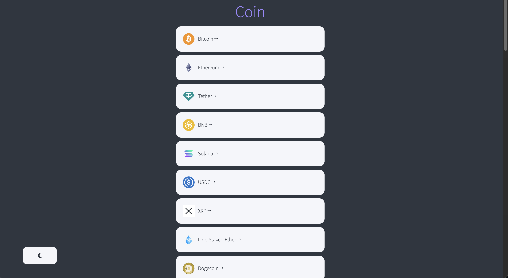

# Crypto Tracker Clone
ReactJS Challenge

## 🔗 Demo
https://jonghwa3471.github.io/crypto-challenge/

## 🖥 Preview

## 🔥 Stack

### Front-end

  

## ✅ Packages

- [x] React
- [x] TypeScript
- [x] Styled-components

## 📖 Theory

- [x] Fetching
- [x] Routes

## 📱 View

- [x] Coin List(home)
- [x] More Info
